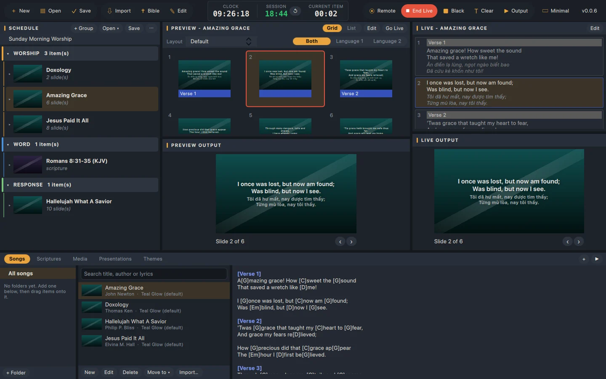

# Psaltercast

Easy-to-use church service software for Windows. Put songs, scripture, presentations and media on screen, and run it all from your phone.

**Download:** https://davidkngo.github.io/psaltercast-release/ or the [latest release](https://github.com/davidkngo/psaltercast-release/releases/latest).

| Platform | File |
|---|---|
| Windows 10/11, 64-bit | `Psaltercast-<version>-windows-x64-setup.exe` |

## Installing

Run the installer. It installs for your user (no administrator password), adds Start menu and desktop shortcuts, and can be removed from Settings › Apps. Updates install from inside the app.

Psaltercast isn't signed by Microsoft yet: if SmartScreen appears, choose **More info → Run anyway**.

Older releases (up to 0.0.5) also have builds for macOS and Linux, and a Windows `.zip`; versions up to 0.0.4 use the app's earlier name, Lucerna.

## About this repository

This repository only hosts releases and the download page (`index.html`, served by GitHub Pages). The builds are made and published here automatically. To report a problem, [open an issue](https://github.com/davidkngo/psaltercast-release/issues).
